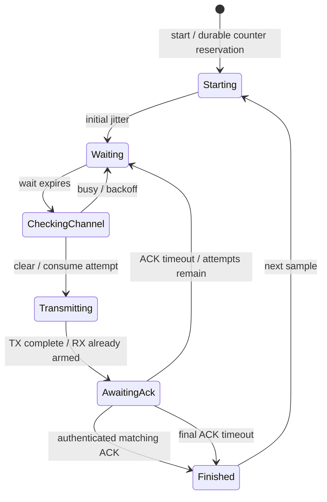

# Delivery controller and module boundaries

The host-tested `SendController` schedules one already-collected sample over an
injected radio. It does not contain an SX1262 driver, sensor reads, receiver radio
loop, server forwarding or MCU deep sleep. The USB administration images still
hold the radio in reset. No physical-radio behavior is validated by these tests.

## Responsibilities

| Component | Responsibility |
| --- | --- |
| Application (future integration) | Read sensors, form `Data`, account for the cycle result and schedule the next measurement. |
| `CajuiProtocol/codec.cpp` | Validate, serialize and authenticate bounded DATA/ACK frames; expose no unauthenticated readings. |
| `CajuiProtocol/delivery.cpp` | Reserve counters, reuse identical DATA on retries, authenticate matching ACKs and persist receiver acceptance before ACK. |
| `CajuiRuntime` | Schedule jitter, channel checks, TX completion, ACK windows, backoff and termination. |
| `Radio` adapter (not implemented) | Operate hardware, capture completion timestamps, bound incoming buffers and manage CAD/TX/RX events. |
| `CajuiStorage` / `CajuiProvisioning` | Durable state and local enrollment; existing public interfaces are preserved. |

These are software boundaries, not seven OSI protocol headers. No wire format,
nonce construction, public protocol API or snapshot schema changed in this split.
The receiver acceptance path remains `receive(binding, frame, journal, ack)`.
Its ACK means durable receiver acceptance, not server delivery. A receiver radio
scheduler and authorized-binding lookup still need integration.

## Cycle

Any active state can terminate on the overall deadline or cancellation. Driver
errors, CAD/TX timeouts and invalid randomness also terminate the cycle. A terminal
path requests radio sleep. Busy-channel checks do not consume TX attempts but do
consume the cycle budget. A failed TX start counts as an attempt because RF emission
may already have started; it terminates instead of blindly retrying the driver.

Defaults reproduce the initial scheduling proposal: 0–500 ms initial jitter,
1,500 ms ACK window from actual TX completion, 100–500 ms backoff after the first
attempt and 200–1,000 ms after the second. Busy-channel waits use the same ranges
based on attempts already made. The complete cycle is limited to 10 seconds,
including durable reservation and busy-channel waits. CAD and TX have independent
1-second and 3-second watchdogs. These are configurable development defaults;
measure them against airtime and NVS latency before selecting a field radio profile.

`poll()` performs bounded work: no busy loop, delay, allocation or unbounded packet
drain. At most one received frame is processed per call. Invalid, stale and
unauthenticated ACKs never reset a deadline. Timeouts take precedence at the exact
deadline; an ACK still queued then is conservatively treated as unconfirmed.

## Adapter and lifetime contract

- All calls are serialized by one owner/task. Do not call the controller from an
  ISR, copy it or mutate enrollment/keys during a cycle. Cancel and successfully
  stop the radio before changing enrollment.
- Inject a monotonic millisecond `Clock`. Its unsigned 32-bit value may wrap. All
  policy intervals are below 2^31 ms; poll regularly and never leave an active
  controller unserviced for 2^31 ms. A clock reset requires a new controller.
- `Radio` operations are nonblocking. A start clears stale events. CAD must finish
  before a transmit starts. The adapter must buffer or otherwise retain fast ACKs
  by entering continuous RX immediately at TX completion, not at the next poll.
- `transmitStatus` reports the actual completion timestamp in the injected clock's
  timebase. Future/stale timestamps are rejected. Polling late does not create a
  new ACK window. Platform interrupt handling is the adapter's responsibility.
- `receive` returns at most one bounded frame; drop malformed/oversized hardware
  input safely. RF CRC does not replace software authentication.
- `sleep()` cancels operations, clears events and releases any retained frame
  reference. It must be idempotent. If it returns false, the controller retains
  the frame and refuses another cycle. Keep the controller and its dependencies
  alive until the adapter owner has recovered and quiesced the radio; then
  reconstruct the controller. Do not destroy it while the driver references it.
- Scheduling `Jitter` returns an inclusive bounded draw or failure. The controller
  validates the range. This interface must never generate keys or GCM nonces;
  provisioning retains its separate cryptographic randomness requirements.

## Results and application integration

`start` refuses overlapping cycles and invalid policies. `ProtocolRejected` exposes
its reason through `protocolResult()` (for example, a storage error); no radio work
starts when counter reservation fails. A successfully started cycle may still end
before TX, consuming a counter safely without emitting a frame.

When `active()` becomes false, inspect `report()`:

- `Acknowledged` means the matching authenticated ACK was accepted.
- Every other completion is unconfirmed; timeout does not prove non-delivery.
- `radioSleeping` separately reports successful radio shutdown. Even confirmed
  delivery can have a shutdown failure; do not enter MCU sleep blindly then.
- `attempts` and saturating `rejectedAcks` are diagnostic counts for the completed
  cycle. The report is retained until the next successful start.

After successful radio shutdown the RAM-only pending frame is released. The caller
must account for an unconfirmed sample before starting the next cycle. There is no
persistent node backlog or automatic sensor scheduling. Reconstructing the
controller after reboot must use the existing durable counter store and credentials.

## Tests

Tests use a fake clock/radio/jitter and the real codec, delivery logic and persistent
store over a fault-injection blob. They cover byte-for-byte wire compatibility,
lost ACKs without duplicate enqueue, failed/ambiguous counter reservations, failed
receiver commits, busy-channel deadlines, attempt limits, replay/tampered ACKs,
clock rollover, delayed polling, driver timeouts, cancellation and failed shutdown.
These simulations do not establish collision rates, radio range or power-cut safety.
